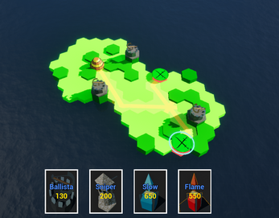

Hexpansion is a tower defense game built in the summer of 2024.

If you wish to play the game without compiling it, please use the link below:
[Released game at itch io](https://fingrevie.itch.io/hextd-prototype)

Our team included:

[LuEklund](github.com/LuEklund)
[Jontssu](github.com/jontssu)
[Doxakis1](github.com/doxakis1)
[Composerjunhee](github.com/composerjunhee)

The game was developed under a 10weeks startup accelerator initiative in Espoo, Finland. You can find more about the accelerator program by following this link:
[Ignite](https://ignite.aaltoes.com/)

You can see bloopers and insights into your game development journey by following our short videos on youtube: 
[Fingrevie Youtube Channel](https://www.youtube.com/@fingrevie)

The game was built using Unreal Engine 5.3. In order to compile this game, Unreal Engine and its dependencies need to be installed, more about the installation process can be found here:
[How to Install Unreal Engine Documentation](https://dev.epicgames.com/documentation/en-us/unreal-engine/installing-unreal-engine)

